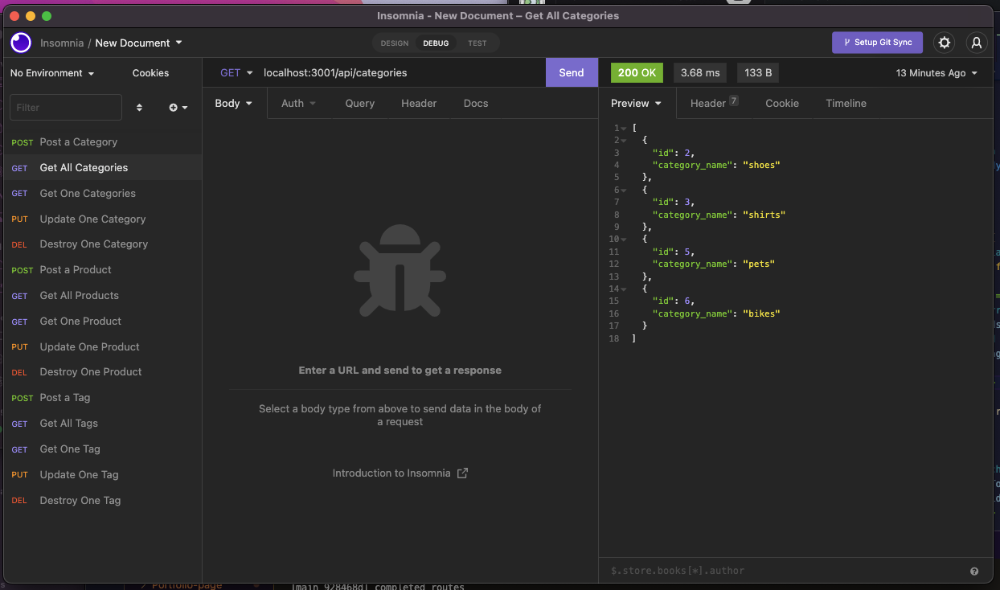

# ecommerceBackend

## <Project ecommerce Backend>

## Table of Contents 

* [Description](#description)

* [Technologies Used](#technologies)

* [User Guide](#user-guide)

* [Link To Video](#videolink)

* [Link To Github](#githublink)

* [Questions](#questions)

## Description

This app allows a user who is owns or works for a company that sells/posts items to add, update and delete products from a database. There are also categories for the products as well as tags for the products that can also be added, updated and deleted. 

## Technologies
Requires npm and uses express, dotenv, sequelize, MySQL2 and Insomnia (or Postman)

## User-Guide
To get started, in your terminal, type in 'npm start'
 
 
You will then need to open your Insomnia app and run the posts, gets, puts and deletes from there. Here is a screenshot to show how I set mine up:
 
 
 

 
 
 
Click on the video (below) to watch the run through of the application 
 
 
 

## VideoLink
<https://drive.google.com/file/d/1xJdBNxqQO_lgahdjoNyrdzFNvMrR-0vm/preview>

## GithubLink
<https://github.com/jennyrae818/ecommerceBackend>

## Questions

If you have any questions about the repo, open an issue or contact [Jenny](undefined) directly at jennyrae818@gmail.com.